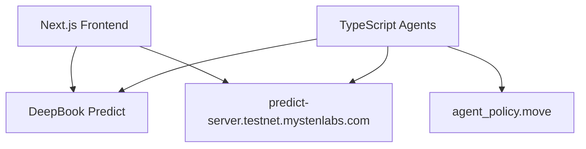

# SuiPredict-AI

**Autonomous AI agents for DeepBook Predict on Sui** — built for Sui Overflow 2026 (DeepBook track).

[](https://overflow.sui.io)

## Overview

SuiPredict-AI integrates the **DeepBook Predict** protocol on Sui testnet with four autonomous agents:

- **Market Strategist** — mints BTC binary positions using vol surface + LLM/rule fallback
- **PLP Manager** — supplies dUSDC to the Predict vault when utilization is high
- **Redeem Keeper** — calls `predict::redeem_permissionless` on settled positions
- **Risk Monitor** — pauses agent policy on critical vault utilization

Agent actions are governed by **`agent_policy.move`** — on-chain budget caps, audit events, and owner revocation.

## Architecture



## Quick Start

### Prerequisites

- Node.js 20+, pnpm, Sui CLI
- Testnet SUI + dUSDC ([request form](https://mystenlabs.notion.site/deepbook-predict-problem-statement))

### Install

```bash
git clone https://github.com/choguun/SuiPredict-AI.git
cd SuiPredict-AI
pnpm install
cp .env.example .env
```

### Smoke Test (Predict E2E)

```bash
pnpm smoke-test
```

### Run Frontend

```bash
pnpm dev:web
# http://localhost:3000
```

### Run Agents

```bash
# Set AGENT_PRIVATE_KEY and AGENT_MANAGER_ID in .env
pnpm dev:agents
# API: http://localhost:3001/decisions
```

## Deployed Contracts (Testnet)

| Contract | Address |
|----------|---------|
| DeepBook Predict Package | `0xf5ea2b3749c65d6e56507cc35388719aadb28f9cab873696a2f8687f5c785138` |
| Predict Object | `0xc8736204d12f0a7277c86388a68bf8a194b0a14c5538ad13f22cbd8e2a38028a` |
| Agent Policy Package | `0x7377808da2e3d48282268c56e332ac282adca02db3a4d924505fa139067ff4e8` |
| dUSDC | `0xe95040085976bfd54a1a07225cd46c8a2b4e8e2b6732f140a0fc49850ba73e1a::dusdc::DUSDC` |

## Project Structure

```
apps/web/          Next.js frontend
apps/agents/       Autonomous agent service
packages/sdk/      Predict PTB helpers + API client
packages/contracts agent_policy.move
docs/              Architecture, demo script, pitch deck
```

## Hackathon Submission

- **Track:** DeepBook (Specialized)
- **Live demo:** Run `pnpm dev:web` + `pnpm dev:agents`
- **Demo script:** [docs/demo-script.md](docs/demo-script.md)
- **Pitch deck:** [docs/pitch-deck.md](docs/pitch-deck.md)

## License

Apache 2.0
