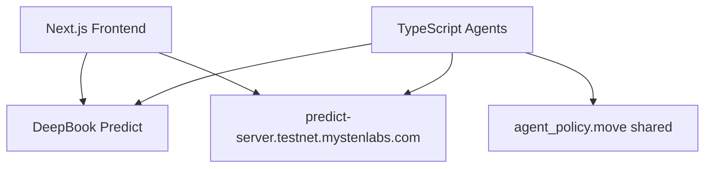

# SuiPredict-AI

**Autonomous AI agents for DeepBook Predict on Sui** — built for Sui Overflow 2026 (DeepBook track).

[](https://overflow.sui.io)

## Overview

SuiPredict-AI integrates the **DeepBook Predict** protocol on Sui testnet with four autonomous agents:

| Agent | Role |
|-------|------|
| **Market Strategist** | Mints BTC binary positions (LLM + optional demo fallback) |
| **PLP Manager** | Supplies dUSDC when vault utilization exceeds threshold |
| **Redeem Keeper** | Calls `predict::redeem_permissionless` on settled positions |
| **Risk Monitor** | Pauses agent policy on critical vault utilization |

Agent actions are governed by **`agent_policy.move`** — shared on-chain policy objects with budget caps, audit events, and owner revocation.

## Architecture



## Quick Start

### Prerequisites

- Node.js 20+, pnpm, Sui CLI
- Testnet SUI + dUSDC ([request form](https://mystenlabs.notion.site/deepbook-predict-problem-statement))

### Install

```bash
git clone https://github.com/choguun/SuiPredict-AI.git
cd SuiPredict-AI
pnpm install
cp .env.example .env
```

### Smoke Test (Predict E2E)

```bash
pnpm --filter @suipredict/sdk build
pnpm smoke-test
```

Creates a PredictManager and attempts a $1 mint (requires dUSDC in wallet).

### Run Frontend

```bash
pnpm dev:web
# http://localhost:3000
```

Pages: **Trade** (mint + redeem), **Vault** (supply/withdraw PLP), **Agents**, **Leaderboard**, **Settings** (create/revoke policy).

### Run Agents

```bash
# Required in .env:
#   AGENT_PRIVATE_KEY
#   AGENT_MANAGER_ID
# Optional:
#   AGENT_POLICY_ID      — from Settings after create policy
#   OPENAI_API_KEY       — LLM strategist
#   DEMO_AUTO_TRADE=true — rule-based mints without LLM

pnpm dev:agents
# API: http://localhost:3001/decisions
```

### Republish Agent Policy (v2 — shared object)

The v2 contract uses a **shared** `AgentPolicy` so agents can call `authorize_spend` without the owner co-signing. The testnet package has been upgraded in-place:

| Package ID (unchanged) | `0x7377808da2e3d48282268c56e332ac282adca02db3a4d924505fa139067ff4e8` |
| Upgrade tx | `JCmZu5jccF7rmUph1xWDLmHGpZdmmnb4KyHgyrAU4xq5` |

Create a **new** policy via **Settings** (v1 owner-owned policies won't work for autonomous agents).

## Deployed Contracts (Testnet)

| Contract | Address |
|----------|---------|
| DeepBook Predict Package | `0xf5ea2b3749c65d6e56507cc35388719aadb28f9cab873696a2f8687f5c785138` |
| Predict Object | `0xc8736204d12f0a7277c86388a68bf8a194b0a14c5538ad13f22cbd8e2a38028a` |
| Agent Policy Package (v2 shared) | `0x7377808da2e3d48282268c56e332ac282adca02db3a4d924505fa139067ff4e8` |
| dUSDC | `0xe95040085976bfd54a1a07225cd46c8a2b4e8e2b6732f140a0fc49850ba73e1a::dusdc::DUSDC` |

> **Note:** Create policies after the v2 upgrade — old owner-owned policies cannot be used by autonomous agents.

## Environment Variables

| Variable | Description |
|----------|-------------|
| `AGENT_PRIVATE_KEY` | Agent wallet private key |
| `AGENT_MANAGER_ID` | PredictManager object ID |
| `AGENT_POLICY_ID` | Shared AgentPolicy object ID |
| `AGENT_POLICY_PACKAGE_ID` | Published Move package ID |
| `DEMO_AUTO_TRADE` | `true` = mint without LLM when dUSDC available |
| `PLP_HIGH_UTILIZATION` | Supply threshold (default `0.001` for testnet) |
| `RISK_PAUSE_UTILIZATION` | Pause threshold (default `0.002`) |

## Project Structure

```
apps/web/          Next.js frontend (trade, vault, agents, settings)
apps/agents/       Autonomous agent service + SQLite decision log
packages/sdk/      Predict PTB helpers + predict-server client
packages/contracts agent_policy.move + Move tests
docs/              Architecture, demo script, pitch deck
.github/workflows  CI (build + Move compile)
```

## Demo Flow

See [docs/demo-script.md](docs/demo-script.md) for the judge walkthrough:

1. Home — live vault + BTC spot
2. Trade — create manager, mint, redeem settled positions
3. Vault — supply / withdraw PLP
4. Agents — live decision feed
5. Settings — create policy, copy ID, revoke

## Hackathon Submission

- **Track:** DeepBook (Specialized)
- **Demo script:** [docs/demo-script.md](docs/demo-script.md)
- **Pitch deck:** [docs/pitch-deck.md](docs/pitch-deck.md)
- **Architecture:** [docs/architecture.md](docs/architecture.md)

## Development

```bash
pnpm build              # Build all packages
pnpm contracts:build    # Move compile
pnpm contracts:test     # Move unit tests
pnpm lint               # Lint all apps
```

## License

Apache 2.0 — see [LICENSE](LICENSE).
