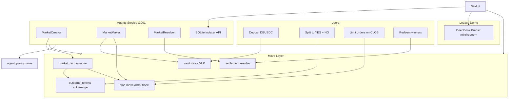

# SuiPredict-AI

**Polymarket-style prediction markets on Sui** — on-chain CLOB, vault LP, and autonomous agents — plus legacy **DeepBook Predict** integration. Built for Sui Overflow 2026 (DeepBook track).

[](https://overflow.sui.io)

## What we built

SuiPredict-AI is a **multi-market prediction exchange** where:

1. Users deposit **DBUSDC** into a vault and receive **VLP** shares
2. Agents allocate vault capital and quote **bid/ask** liquidity on an **on-chain order book**
3. Users **split** collateral → **YES + NO** tokens, **trade YES** with limit orders, then **redeem** winners after resolution
4. **Market Creator**, **Market Maker**, and **Market Resolver** agents run autonomously (LLM + rule fallbacks)
5. Legacy **DeepBook Predict** flows remain at `/legacy/predict/*` for protocol comparison

**Polymarket complement:** `split(1 DBUSDC) → 1 YES + 1 NO` and `merge(1 YES + 1 NO) → 1 DBUSDC`. The UI shows implied NO price as `1 − YES`.

## Architecture



See [docs/architecture.md](docs/architecture.md) for sequence diagrams and [docs/demo-script.md](docs/demo-script.md) for the judge walkthrough.

### Primary: CLOB stack

| Layer | Technology | Purpose |
|-------|------------|---------|
| **Move** | `vault`, `vlp`, `registry`, `market_factory`, `outcome_tokens`, `clob`, `settlement`, `types` | Markets, split/merge, order book, resolve/redeem |
| **Policy** | `agent_policy.move` (shared object v2) | Agent budget caps, pause, audit events |
| **SDK** | `@suipredict/sdk` | PTB builders, DeepBook V3 client, indexer REST client |
| **Indexer** | `apps/agents` + SQLite | `/markets`, order book, portfolio, vault summary |
| **Agents** | TypeScript | Creator → Maker → Resolver (+ Risk Monitor) |
| **Frontend** | Next.js + dApp Kit | Markets, vault, portfolio, agents dashboard |

### Legacy: DeepBook Predict

| Agent | Role |
|-------|------|
| **Market Strategist** | Mints BTC binary positions (LLM + demo fallback) |
| **PLP Manager** | Supplies dUSDC when vault utilization is high |
| **Redeem Keeper** | `predict::redeem_permissionless` on settled positions |
| **Risk Monitor** | Pauses policy on critical utilization (shared with CLOB cycle) |

Enable legacy agents with `ENABLE_LEGACY_PREDICT_AGENTS=true` in `.env`.

### Stablecoins & tokens

| Token | Used for |
|-------|----------|
| **DBUSDC** | CLOB vault, split/merge, on-chain trading |
| **dUSDC** | Legacy DeepBook Predict mint/redeem, PLP |
| **DEEP** | Optional DeepBook V3 pool creation (~500 DEEP/pool) via `@mysten/deepbook-v3` |
| **SUI** | Gas (testnet faucet) |

> **Note:** The MVP uses an **on-chain Move CLOB** (`clob.move`) so demos work without paying 500 DEEP per pool. The DeepBook V3 SDK is wired for optional external YES/DBUSDC pools when funded.

## Quick start

### Prerequisites

- Node.js 20+, [pnpm](https://pnpm.io), [Sui CLI](https://docs.sui.io/guides/developer/getting-started/sui-install)
- Testnet **SUI** (faucet); **DBUSDC** / **dUSDC** / **DEEP** via [DeepBook testnet forms](https://mystenlabs.notion.site/deepbook-predict-problem-statement)

### Install

```bash
git clone https://github.com/choguun/SuiPredict-AI.git
cd SuiPredict-AI
pnpm install
cp .env.example .env
pnpm --filter @suipredict/sdk build
```

### Demo mode (no on-chain deploy)

The agents service seeds **demo markets** and serves the indexer API without a wallet:

```bash
pnpm dev:agents   # http://localhost:3001 — /markets, /decisions, etc.
pnpm dev:web      # http://localhost:3000 — Markets, Vault, Portfolio
```

Open **Markets** → pick a demo market → view live order book (agent-fed quotes).

### Agents with wallet (on-chain)

```bash
# Required in .env:
AGENT_PRIVATE_KEY=<suiprivkey or hex>

# Optional — after publishing Move package:
MARKET_REGISTRY_ID=
VAULT_OBJECT_ID=
VLP_TREASURY_CAP_ID=
OPENAI_API_KEY=          # LLM for Creator / Resolver

pnpm dev:agents
```

**Agent cycle (every 15s):** Resolver → Creator → Maker → Risk Monitor (+ legacy Predict agents if enabled).

### Publish Move package (testnet)

```bash
pnpm contracts:test     # 5 tests: agent_policy + market (split, CLOB, resolve)

cd packages/contracts
sui client publish --gas-budget 500000000
```

After publish, initialize on-chain objects and set env vars:

1. `registry::create_registry` → `MARKET_REGISTRY_ID`
2. Publish triggers `vlp::init` → transfer treasury cap, then `vault::create_vault` → `VAULT_OBJECT_ID`
3. Copy package ID → `MARKET_PACKAGE_ID`, `NEXT_PUBLIC_MARKET_PACKAGE_ID`

### Legacy Predict smoke test

```bash
pnpm smoke-test
```

Creates a PredictManager and attempts a $1 mint (requires **dUSDC** in agent wallet).

## Frontend routes

| Route | Description |
|-------|-------------|
| `/` | Hero, featured markets, vault TVL |
| `/markets` | Multi-market list (category, expiry, status) |
| `/markets/[id]` | Order book, YES/NO tabs, limit orders, split/merge, redeem |
| `/vault` | Deposit/withdraw DBUSDC → VLP, MM allocation stats |
| `/portfolio` | YES/NO balances per market |
| `/agents` | Creator / Maker / Resolver decision feed |
| `/settings` | Create/revoke `agent_policy` shared object |
| `/leaderboard` | Predict-server volume (legacy) |
| `/legacy/predict/trade` | DeepBook Predict mint + redeem |
| `/legacy/predict/vault` | PLP supply/withdraw (dUSDC) |
| `/trade` | Redirects to `/legacy/predict/trade` |

## Indexer & agent API (`:3001`)

| Endpoint | Description |
|----------|-------------|
| `GET /health` | Service status |
| `GET /markets` | All markets (registry + SQLite cache) |
| `GET /markets/:id` | Market metadata, expiry, outcome, pool_id |
| `GET /markets/:id/book` | L2 bids/asks, spread, mid price |
| `GET /markets/:id/trades` | Recent fills |
| `GET /portfolio/:address` | YES/NO balances per market |
| `GET /vault/summary` | VLP TVL + agent allocation |
| `GET /decisions` | Agent decision log (SQLite) |
| `GET /stats` | Agent action counts |

Demo data is stored in `apps/agents/data/markets.db`.

## Project structure

```
apps/
  web/                 Next.js frontend (CLOB primary + legacy Predict)
  agents/              Autonomous agents + markets indexer API
    src/agents/        market-creator, market-maker, market-resolver, risk-monitor
    src/agents/legacy/ market-strategist, plp-manager, redeem-keeper
    src/markets/       SQLite store + HTTP routes
packages/
  contracts/           Move: vault, clob, market_factory, outcome_tokens, settlement, registry, agent_policy
  sdk/                 @suipredict/sdk
    src/deepbook/      DeepBook V3 constants + client wrappers
    src/markets/       Factory PTBs, indexer client, types
    src/predict/       Legacy Predict re-exports
docs/                  architecture.md, demo-script.md, agent-prompts.md
```

## Environment variables

| Variable | Description |
|----------|-------------|
| `AGENT_PRIVATE_KEY` | Agent wallet (server-side only) |
| `MARKET_REGISTRY_ID` | Shared `MarketRegistry` object |
| `VAULT_OBJECT_ID` | Shared `ProtocolVault` object |
| `VLP_TREASURY_CAP_ID` | VLP treasury cap (for vault init) |
| `MARKET_PACKAGE_ID` | Published Move package ID |
| `AGENT_POLICY_ID` | Shared `AgentPolicy` object (from Settings) |
| `AGENT_MANAGER_ID` | PredictManager ID (legacy agents) |
| `ENABLE_LEGACY_PREDICT_AGENTS` | `true` to run Predict strategist/PLP/redeem |
| `OPENAI_API_KEY` | LLM for Creator / Resolver / Strategist |
| `MM_SPREAD_THRESHOLD_BPS` | Market maker quote threshold (default `400`) |
| `MAX_ACTIVE_MARKETS` | Creator cap (default `5`) |
| `NEXT_PUBLIC_AGENTS_URL` | Indexer base URL (default `http://localhost:3001`) |
| `NEXT_PUBLIC_VAULT_OBJECT_ID` | Vault ID for frontend deposits |

Full list: [.env.example](.env.example).

## Deployed contracts (testnet)

| Contract | Address |
|----------|---------|
| Agent Policy + Markets Package (v2) | `0x7377808da2e3d48282268c56e332ac282adca02db3a4d924505fa139067ff4e8` |
| DeepBook Predict Package | `0xf5ea2b3749c65d6e56507cc35388719aadb28f9cab873696a2f8687f5c785138` |
| Predict Object | `0xc8736204d12f0a7277c86388a68bf8a194b0a14c5538ad13f22cbd8e2a38028a` |
| DeepBook V3 Package | `0x22be4cade64bf2d02412c7e8d0e8beea2f78828b948118d46735315409371a3c` |
| DBUSDC | `0xf7152c05930480cd740d7311b5b8b45c6f488e3a53a11c3f74a6fac36a52e0d7::DBUSDC::DBUSDC` |
| dUSDC (Predict) | `0xe95040085976bfd54a1a07225cd46c8a2b4e8e2b6732f140a0fc49850ba73e1a::dusdc::DUSDC` |

> Create a **new** `AgentPolicy` via **Settings** after the v2 upgrade — old owner-owned policies cannot be used by autonomous agents.

## Development

```bash
pnpm build              # Build all packages
pnpm dev                # Turbo dev (web + agents)
pnpm contracts:build    # Move compile
pnpm contracts:test     # Move unit tests (5 passing)
pnpm lint               # Lint all apps
pnpm smoke-test         # Legacy Predict E2E
```

## Hackathon submission

- **Track:** DeepBook (Specialized)
- **Demo script:** [docs/demo-script.md](docs/demo-script.md)
- **Architecture:** [docs/architecture.md](docs/architecture.md)
- **Agent prompts:** [docs/agent-prompts.md](docs/agent-prompts.md)
- **Pitch deck:** [docs/pitch-deck.md](docs/pitch-deck.md)

**Judge narrative:** Polymarket-style P2P order book with autonomous agents creating markets, quoting liquidity from a user vault, and resolving outcomes — plus legacy DeepBook Predict integration showing protocol breadth.

## License

Apache 2.0 — see [LICENSE](LICENSE).
