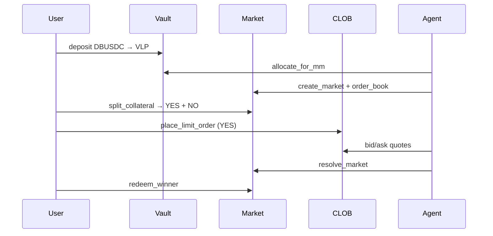

# Architecture

## Dual stack

| Stack | Protocol | Collateral | Trading |
|-------|----------|------------|---------|
| **Primary (CLOB)** | `suipredict_agent_policy` Move package | DBUSDC | On-chain order book (`clob.move`) |
| **Legacy (Predict)** | DeepBook Predict testnet | dUSDC | Vault mint/redeem (no CLOB) |

Optional **DeepBook V3** integration (`@mysten/deepbook-v3`) supports external YES/DBUSDC pools when funded with 500 DEEP per pool.

## CLOB layers

| Layer | Technology | Purpose |
|-------|------------|---------|
| Move | `vault`, `market_factory`, `outcome_tokens`, `clob`, `settlement`, `registry` | Markets, split/merge, order book, resolve/redeem |
| Policy | `agent_policy.move` | Agent budget caps (shared object) |
| SDK | `@suipredict/sdk` | PTB builders, DeepBook client, indexer REST client |
| Indexer | `apps/agents` SQLite + REST | `/markets`, `/markets/:id/book`, `/portfolio/:addr` |
| Agents | Creator → Maker → Resolver (+ Risk) | Autonomous market lifecycle |
| Frontend | Next.js | `/markets`, `/vault` (VLP), `/portfolio` |

## CLOB data flow

## Legacy Predict flow

1. User: dUSDC → `predict::mint`
2. PLP Manager: `predict::supply` when utilization high
3. Redeem Keeper: `predict::redeem_permissionless` on settled oracles
4. Risk Monitor: `agent_policy::pause` if critical

## Security

- Agent keys in `AGENT_PRIVATE_KEY` only (server-side)
- `AgentPolicy` caps spend and emits audit events
- Market resolver restricted to market creator on-chain (agent wallet)

## References

- [DeepBook Predict](https://docs.sui.io/onchain-finance/deepbook-predict/contract-information)
- [DeepBook V3](https://docs.sui.io/standards/deepbookv3-sdk)
